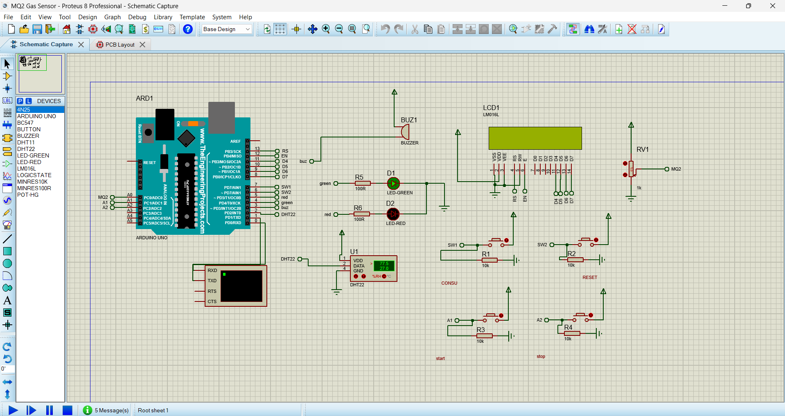

# Temperature and Gas Detector 🚨

This project is an Arduino-based **Temperature and Gas Detector**. It uses sensors to monitor the ambient temperature and detect harmful gases in the environment. If thresholds are exceeded, it triggers alerts such as LEDs or a buzzer. This system is ideal for safety monitoring in homes, offices, or workshops.

---

## Features ✨

- **Temperature Monitoring**: Continuously tracks the ambient temperature.
- **Gas Detection**: Detects harmful gases like LPG, methane, or carbon monoxide.
- **Alerts**:
  - An LED lights up when thresholds are exceeded.
  - A buzzer sounds as an audible warning.
- **Simulation Support**: Circuit design is provided for easy reference.

---

## Components Used 🛠️

1. **Arduino Board**: (e.g., Arduino Uno, Nano, or similar)
2. **Temperature Sensor**: (e.g., LM35, DHT11, or DHT22)
3. **Gas Sensor**: (e.g., MQ-2, MQ-5, or MQ-7)
4. **Buzzer**: For audio alerts.
5. **LEDs**: For visual alerts.
6. **Resistors**: For circuit connections.
7. **Breadboard**: For prototyping.
8. **Connecting Wires**: To link components.

---

## Circuit Simulation 📷

Here’s a simulation of the circuit design:




## How It Works 🖥️

1. The Arduino reads temperature data from the temperature sensor and gas level data from the gas sensor.
2. If the temperature exceeds a predefined threshold, it triggers an alert (LED and/or buzzer).
3. Similarly, if the gas level exceeds a safe limit, an alert is triggered.
4. The system continuously monitors both parameters in real-time.

---

## Installation and Usage 🚀

1. **Clone the Repository**:
   ```bash
   git clone https://github.com/<Azizzr02>/<Temperature-and-Gas-Detector>.git
